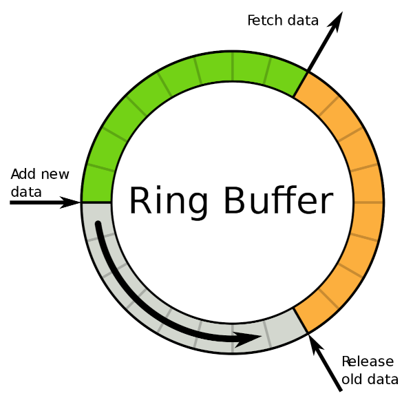

# Circular Buffer
Circular buffer (or Ring Buffer) is a data structure that operates as a fixed length array but wrapped around its end.
It can be used for different purposes such as in-memory logging, digital signal processing algorithms, bufferning input data from peripheral devices, etc.

It looks like an array but encircled.

## How it works

Lets consider we're filling in the buffer counterclockwise
### Read position
The green area is everything we haven't read yet. The read position is the rightmost cell of this area (`Fetch data` arrow) aslo called `tail`
### Write position
To insert new data we need to go to the end of a green area as it's the `head` (`Add new data` arrow). 
### Old data
Everything within an orange area is considered outdated as it's behind the `tail`, which means it's already been read before.
### Free space
The greyish area is unused space. As soon as this area reaches the end (`head` points at the beginning of an orage area) the buffer is full and every next insertion replaces old data with new values.
### Full and empty
So our `head` and `tail` positions run in circles over and over as long as there's something to read and to write. 

How can we tell that the buffer is empty or full then? 

The buffer is considered to be empty when the `head` position is just behind the `tail` and considered to be full when they both point at the same place.

> It's a bit of a question what to do when insertion happens to be faster then reading. It's up to a developer to choose whether we block every write operation here until the `tail` moves any further or we just loose the unread data and keep on replacing unread elements with new ones.

> In our example we don't allow to insert new data when the buffer is full

## Implementation
Let's see how we can implement such a structure step by step
### class CircularBuffer 
We need to frist create a new class `CircularBuffer` that has the following:
- A parametrized constructor with one argument holding the buffer size in bytes. Here we allocate new memory for our buffer
- A pointer to a dynamically allocated buffer
- A destructor to deallocate memory when the buffer object is destroyed
- Two pointers to keep track of our data. The `tail` and the `head`

