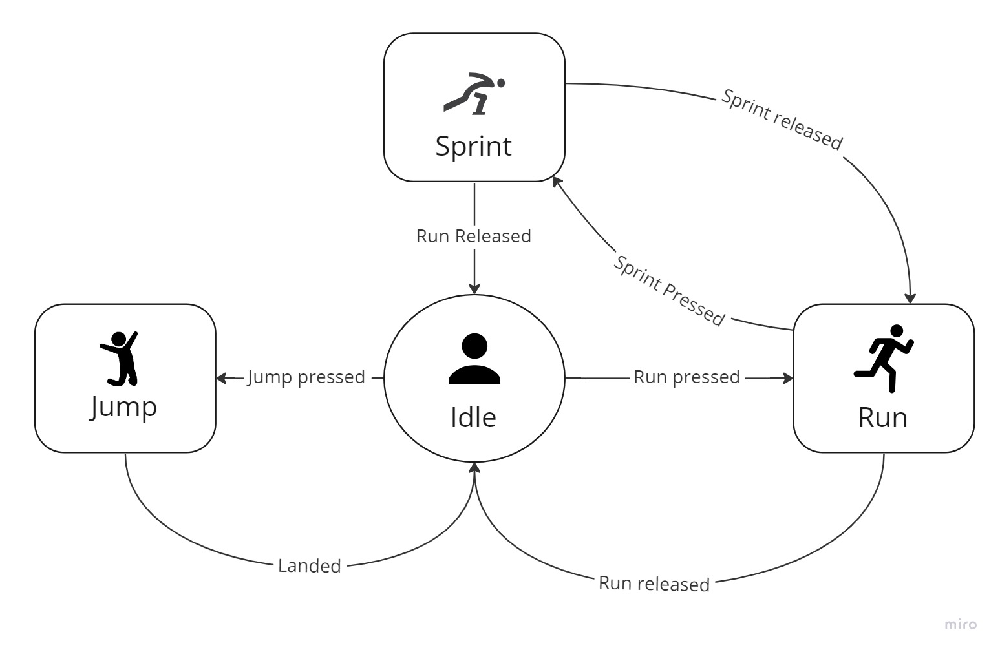

# State 
## Finite State Machine (FSM)
A finite state machine is a mechanism that allows to define an object that has internal states. The object can change these states when an event happens.

For ex., we can have an object called Hero. The hero can be idle and do nothing or can jump, run or sprint whilst already running. 



Every state change is initiated by an incoming event like a controller or a keyboard button press.
So if we press an Up button the hero's gonna jump or if we hold a run button they're gonna run and so on.

## States and Events
Hero  is in fact the State Machine.
There's a fixed set of states and events spawning state transitions. 

One way to describe state and transitions between them is a control flow chart like above. Another pretty common way is a transition table like below

|   	|Idle	        | Run  	        |
|---	|---	        |---	        |
|Idle  	|x   	        | Run pressed  	|
|Run   	|Run released   |x   	        |
|   	|   	        |   	        |

The first column and row contain states to transit from and to respectively.

We keep transition events in row and column intersections. 

So, for ex., if the Hero is in the Idle state and the run button is pressed the state is changed from Idle to Run.

## Initial State
There's always an initial state that is entered once a state machine starts working.

If we look at our Hero state machine example we can clearly see that the initial state is Idle and we can gets into 2 possible states from it (Run and Jump) when the corresponding events (Jump pressed, Run pressed) happen.

## Gun State Machine Task
You need to implement a state machine representing a gun with 3 possible states: 
- Idle
- Shooting
- Reloading

All transitions are caused by keyboard events. This could be described as follows

|   	    |Idle	            |Shooting           |Reloading          |
|---	    |---	            |---	            |---                |
|Idle  	    |x   	            |Fire pressed       |Reload key pressed |
|Shooting   |Fire released      |x   	            |Reload key pressed |
|Reloading  |Reload finished    |Fire pressed       |x                  |
## Events
We can use enum to hold a unique constant for every possible keyboard event

```
enum class Event 
{
    Event1,
    Event2,
    ...
}
```
## Abstract State
First we need to create an abstract class for all possible states.
It should have the following methods:
|Method      |Description                                               |
|---         |---                                                       |
|handleEvent |Handles an incoming event                                 |
|enterAction | Does actions required to do at the state entrance        |  
|action      | Does the state job. Called repeatedly from the main loop |
|exitAction  | Does actions required to do at the state exit            |

Initial state is set at an object construction
## Concrete States
All concrete states are derived from an abstract state and implement its interface

## State Machine
State machine should keep its current state and change it to a new state whenever a new transition happens.
Besides that there should be at least two methods. One for handling incoming events and changing states. And the second to do repeated actions done by the current state.

## Hero Example
As an example you can use a Hero state machine implemented in `Hero.h` and `Hero.cpp`

## References
- [Refactoring Guru. State](https://refactoring.guru/design-patterns/state)
- [SOLID Design Principles](https://hackernoon.com/10-oop-design-principles-every-programmer-should-know-f187436caf65)